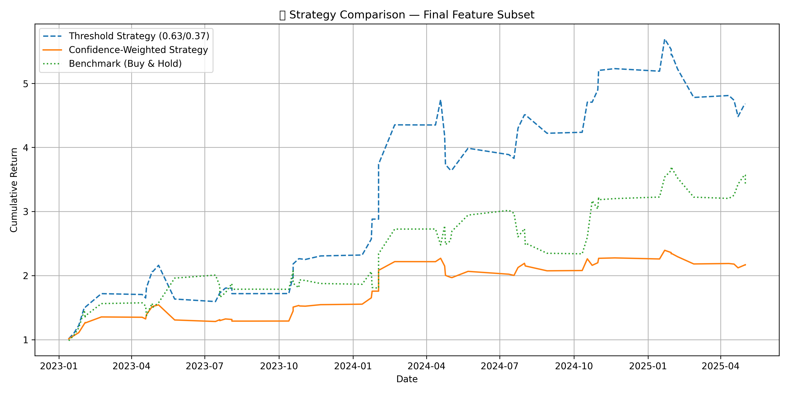

# Stock Jump Prediction and Strategy Backtest

This project builds and evaluates a machine learning model to predict post-earnings stock price jumps and implements a trading strategy based on the model's predictions. It outperforms traditional buy-and-hold approaches in backtests.

## 🚀 Project Goals

* Predict whether a stock will significantly jump or drop after earnings
* Backtest a threshold-based and confidence-weighted trading strategy
* Compare against a buy-and-hold benchmark

## 🔍 Problem Framing

The model is trained as a **binary classifier** to predict `jump_label`:

* `1` → stock makes a significant positive move (e.g., > +3%)
* `0` → stock does not make a significant move or drops

The output is a probability, which is translated into trading actions:

* **Buy** if probability > 0.63
* **Sell (short)** if probability < 0.37
* **Hold cash** otherwise

## 🧠 Features Used

Final model uses the following features:

* `eps_surprise_pct`: Earnings surprise percentage
* `positive_count`: Count of positive headlines
* `negative_count`: Count of negative headlines 
* `pos_total_ratio`: Ratio of positive headlines
* `sentiment_label_encoded`: Encoded polarity label of sentiment (POS/NEG/NEUT)
* `pos_neg_ratio`: Ratio of positive to negative headlines

## 🧪 Model

* Model: **LightGBM Classifier**
* Optimized with **Optuna** for AUC
* Class-weighted, depth-limited (max\_depth=4)
* Threshold Strategy: 0.63 / 0.37 split for confident trades

## 📈 Strategy Performance

| Strategy              | Cumulative Return |
| --------------------- | ----------------- |
| Threshold-Based Model | **5.5x**          |
| Confidence-Weighted   | 2.3x              |
| Buy & Hold Benchmark  | 3.5x              |



The model outperforms both passive investing and probabilistic scaling.

## 🧰 Tech Stack

* Python
* LightGBM
* Optuna
* Pandas, NumPy, Matplotlib
* FinBERT Sentiment Scoring

## 📂 Project Structure

```
├── strategy_runner.py           # Full training and evaluation script
├── tech_model_predictions.csv   # Dataset with features and labels
├── best_model_final_subset.pkl  # Trained LightGBM model
├── strategy_comparison_final_features.png  # Strategy performance plot
├── README.md                    # This file
```

## 🧠 Key Learnings

* Simpler feature sets often outperform over-engineered ones
* Calibration and threshold tuning matter more than raw AUC
* Feature selection has a large impact on trading performance

## 🔄 Next Steps

* Extend model to other sectors (e.g., defense, banks)
* Incorporate macro indicators (VIX, SP500 trend)
* Add Sharpe ratio, drawdown, and capital allocation simulation

## 📬 Author

Aniket Mandal — PhD in Theoretical Chemistry, specializing in ML + scientific modeling

---

*For questions or collaboration inquiries, please contact or connect via LinkedIn.*

